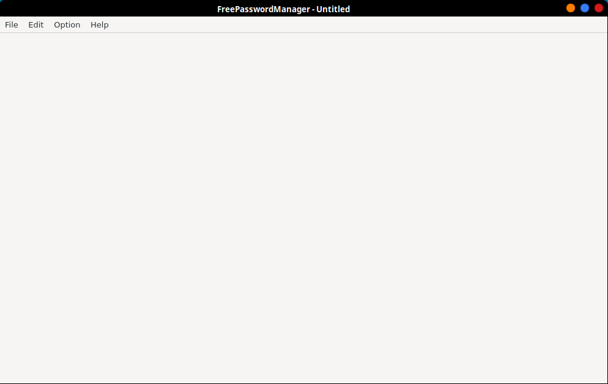
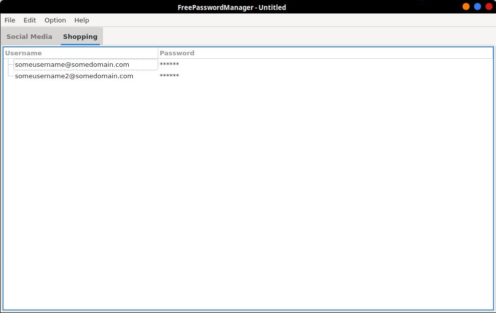

FreePasswordManager v.1.00
=================
A simple password manager that supports encryption.

Screenshot
=================



Usage:
=================
To run type:
```bash
python3 fpm.py
```

Prerequisites:
=================
The following libraries / frameworks must be installed for FreePasswordManager to run: Python 3.x, Qt 5.x framework, PyQt5, pyperclip

To Do:
=================
1. Fix the problem where, when there are multiple categories, adding a new username / password changes the focus to the first category
2. Adding a comment section
3. Adding a name section
4. Integrate to Firefox / Chrome?
	
Author:
=================
Marvin Manese
